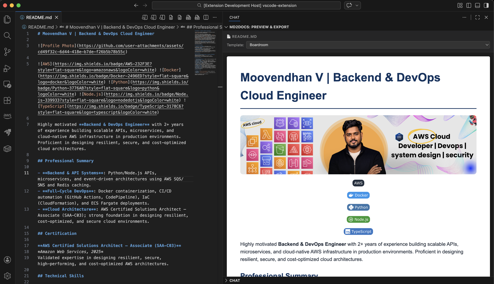
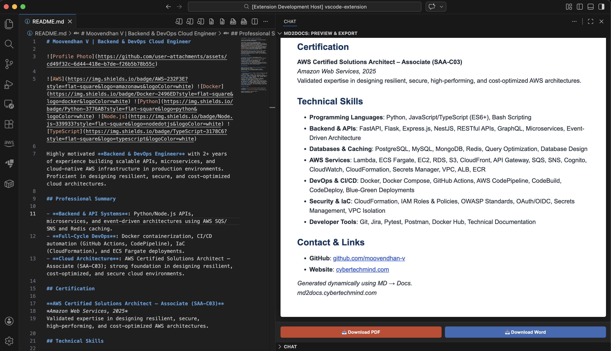

# Moovendhan V | Backend & DevOps Cloud Engineer

    

Highly motivated **Backend & DevOps Engineer** with 2+ years of experience building scalable APIs, microservices, and cloud-native AWS infrastructure in production environments. Proficient in designing resilient, secure, and cost-optimized cloud architectures.

## Professional Summary

- **Backend & API Systems**: Python/Node.js APIs, microservices, and event-driven architectures using AWS SQS/SNS and Redis caching.
- **Full-Cycle DevOps**: Docker containerization, CI/CD automation (GitHub Actions, CodePipeline), IaC (CloudFormation), and ECS Fargate deployments.
- **Cloud Architecture**: AWS Certified Solutions Architect – Associate (SAA-C03); strong foundation in designing resilient, cost-optimized, and secure cloud environments.

## Certification

**AWS Certified Solutions Architect – Associate (SAA-C03)**
*Amazon Web Services, 2025*
Validated expertise in designing resilient, secure, high-performing, and cost-optimized AWS architectures.

## Technical Skills

- **Programming Languages**: Python, JavaScript/TypeScript (ES6+), Bash Scripting
- **Backend & APIs**: FastAPI, Flask, Express.js, NestJS, RESTful APIs, GraphQL, Microservices, Event-Driven Architecture
- **Databases & Caching**: PostgreSQL, MySQL, MongoDB, Redis, Query Optimization, Database Design
- **AWS Services**: Lambda, ECS Fargate, EC2, RDS, S3, CloudFront, API Gateway, SQS, SNS, Cognito, CloudWatch, CloudFormation, Secrets Manager, VPC, ALB, ECR
- **DevOps & CI/CD**: Docker, Docker Compose, GitHub Actions, AWS CodePipeline, CodeBuild, CodeDeploy, Blue-Green Deployments
- **Security & IaC**: CloudFormation, IAM Roles & Policies, OWASP Standards, OAuth/OIDC, Secrets Management, VPC Isolation
- **Developer Tools**: Git, Jira, Pytest, Postman, Docker Hub, Technical Documentation

## Contact & Links

- **GitHub**: [github.com/moovendhan-v](https://github.com/moovendhan-v)
- **Website**: [cybertechmind.com](https://cybertechmind.com)

*Generated dynamically using MD → Docs.*
*md2docs.cybertechmind.com*
